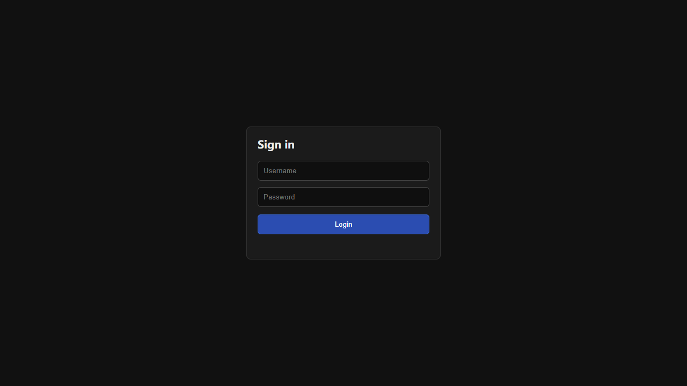
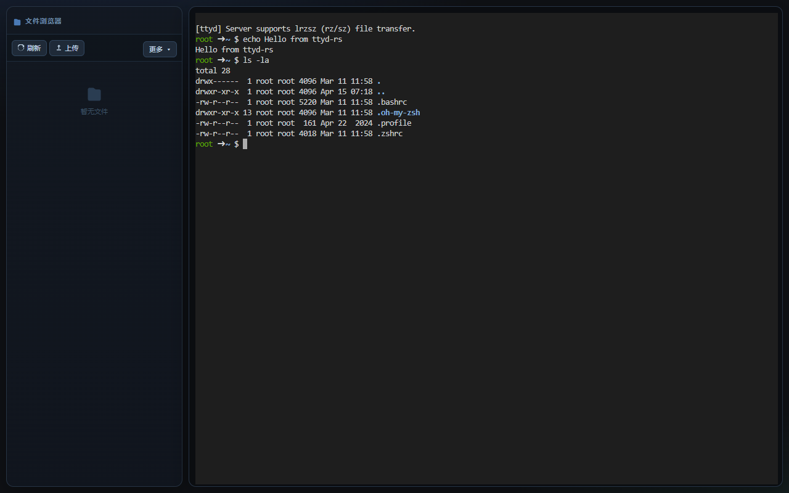
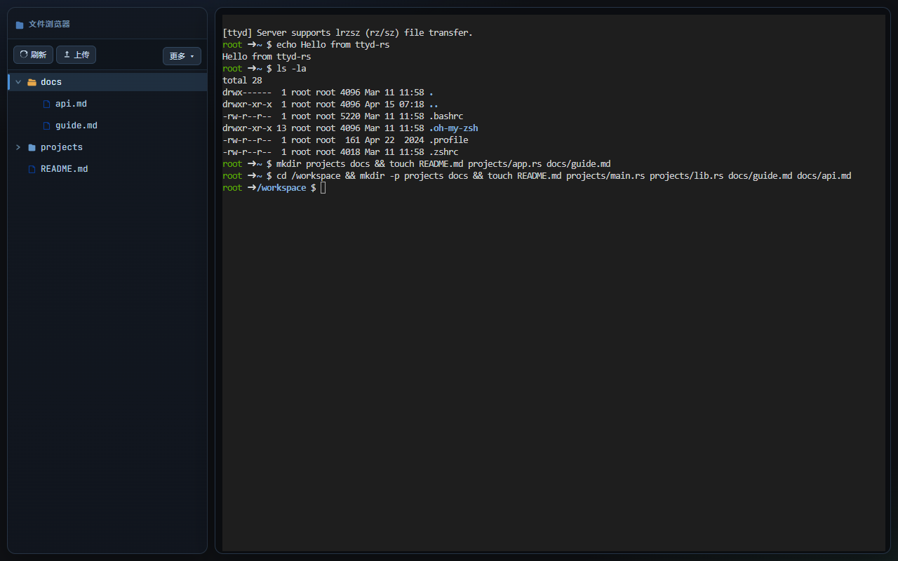
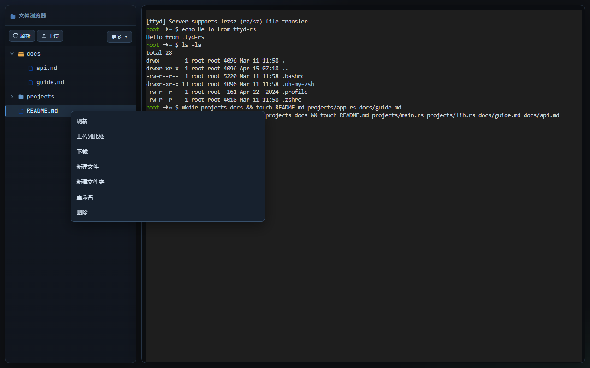

<div align="center">

# ttyd-rs

**Share your terminal over the web — a Rust rewrite of [ttyd](https://github.com/tsl0922/ttyd)**

[](https://github.com/lihongjie0209/ttyd-rs/actions)
[](LICENSE)
[](https://www.rust-lang.org)
[](#platform-support)

A single self-contained binary that exposes any shell in your browser via WebSocket. Dark-themed xterm.js UI, built-in file browser, end-to-end Noise encryption, and audit logging — zero runtime dependencies.

[Quick Start](#quick-start) · [Features](#features) · [Windows](#windows) · [Docker](#docker) · [Nginx](#nginx-reverse-proxy) · [Security](docs/SECURITY.md)

</div>

---

## Screenshots

| Login | Terminal |
|-------|----------|
|  |  |

| File Browser | Context Menu |
|-------------|--------------|
|  |  |

---

## Features

| Feature | Description |
|---------|-------------|
| **PTY over WebSocket** | Full xterm.js terminal rendered in any browser |
| **Cross-platform** | Runs on Linux, macOS, and **Windows** (cmd / PowerShell / WSL) |
| **Auth-gated login** | Login page shown when `--credential` is set; terminal hidden until authenticated |
| **File browser** | List, upload, download (dirs as `.zip`), rename, delete, new file/dir, right-click menu |
| **WS Noise encryption** | `Noise_NN_25519_ChaChaPoly_SHA256` enabled by default — no TLS cert required |
| **Basic Auth & proxy auth** | `-c user:pass` or delegate to upstream via `--auth-header` |
| **IP allowlist** | CIDR-based filtering with `--allow-ip` |
| **lrzsz transfer** | `rz`/`sz` file transfer with first-login hint |
| **Audit log** | JSONL structured log of every connection, command, and file operation |
| **Sub-path mount** | `--base-path` for reverse-proxy deployments |
| **Read-only mode** | `--readonly` disables all terminal input |
| **Single binary** | Frontend assets gzip-embedded at build time — nothing to deploy separately |

---

## Quick Start

```bash
# Linux / macOS
cargo run -- -c admin:admin --port 7681 bash

# Windows (cmd)
cargo run -- -c admin:admin --port 7681 cmd

# Windows (PowerShell)
cargo run -- -c admin:admin --port 7681 powershell
```

Open `http://localhost:7681` and sign in with `admin / admin`.

<details>
<summary>More options</summary>

```bash
# Disable WS Noise (plain WebSocket)
cargo run -- --disable-ws-noise -c admin:admin --port 7681 bash

# Enable audit log
cargo run -- --audit-log ./audit.log -c admin:admin --port 7681 bash

# Read-only terminal (view only, no input)
cargo run -- --readonly -c admin:admin --port 7681 bash

# Set file browser root to a specific directory
cargo run -- --cwd /srv/data -c admin:admin --port 7681 bash
```

</details>

---

## Windows

ttyd-rs runs natively on Windows — no WSL or Cygwin required.

**Prerequisites**

- [Rust](https://rustup.rs/) (stable)
- [Node.js](https://nodejs.org/) 18+ (for the frontend build step)
- [NASM](https://www.nasm.us/) (required by `aws-lc-sys`; add to `PATH`)
- [Visual Studio Build Tools](https://visualstudio.microsoft.com/visual-cpp-build-tools/) with the "Desktop development with C++" workload

**Build & run**

```powershell
cargo build --release
# Output: target\release\ttyd.exe

.\target\release\ttyd.exe -c admin:admin --port 7681 cmd
```

**Supported shells on Windows**

| Shell | Command |
|-------|---------|
| Command Prompt | `ttyd.exe ... cmd` |
| PowerShell | `ttyd.exe ... powershell` |
| PowerShell 7 | `ttyd.exe ... pwsh` |
| Git Bash | `ttyd.exe ... "C:\Program Files\Git\bin\bash.exe"` |
| WSL | `ttyd.exe ... wsl` |

> **Note:** `lrzsz` (`rz`/`sz`) is a Linux/macOS utility and is not available natively on Windows. All other features work cross-platform.

---

## Build

`build.rs` automatically runs `npm install && npm run build` inside `frontend/` and embeds the output into the binary:

```bash
cargo build --release
# Linux/macOS → target/release/ttyd
# Windows     → target\release\ttyd.exe
```

---

## Docker

### Minimal image (`Dockerfile`)

```bash
docker build -t ttyd-rs:latest .

# No auth
docker run --rm -p 7681:7681 ttyd-rs:latest

# With auth (via TTYD_ARGS)
docker run --rm -p 7681:7681 -e TTYD_ARGS="-c admin:admin" ttyd-rs:latest
```

### Full Ubuntu image (`Dockerfile.ubuntu`)

Pre-installed: vim, zsh, git, curl, wget, htop, jq, python3, ripgrep, lrzsz, and more.

```bash
docker build -f Dockerfile.ubuntu -t ttyd-rs-ubuntu:latest .
docker run --rm -p 7681:7681 -e TTYD_ARGS="-c admin:admin" ttyd-rs-ubuntu:latest

# Or pull from DockerHub
docker pull lihongjie0209/ttyd-rs-ubuntu:latest
docker run --rm -p 7681:7681 -e TTYD_ARGS="-c admin:admin" lihongjie0209/ttyd-rs-ubuntu:latest
```

The `docker-entrypoint.sh` reads `TTYD_ARGS` and prepends them to the command.

---

## Nginx Reverse Proxy

ttyd-rs uses WebSocket (with optional Noise encryption) and requires proper proxy headers.

<details>
<summary>Basic HTTP proxy</summary>

```bash
ttyd -p 7681 -c admin:secret bash
```

```nginx
server {
    listen 80;
    server_name terminal.example.com;

    location / {
        proxy_pass         http://127.0.0.1:7681;
        proxy_http_version 1.1;

        proxy_set_header Upgrade    $http_upgrade;
        proxy_set_header Connection "upgrade";

        proxy_set_header Host              $host;
        proxy_set_header X-Real-IP         $remote_addr;
        proxy_set_header X-Forwarded-For   $proxy_add_x_forwarded_for;
        proxy_set_header X-Forwarded-Proto $scheme;

        proxy_read_timeout  3600s;
        proxy_send_timeout  3600s;
    }
}
```

</details>

<details>
<summary>HTTPS + WSS (recommended for production)</summary>

Noise encryption can be disabled when TLS is terminated by nginx:

```bash
ttyd -p 7681 -c admin:secret --disable-ws-noise bash
```

```nginx
server {
    listen 443 ssl http2;
    server_name terminal.example.com;

    ssl_certificate     /etc/nginx/ssl/fullchain.pem;
    ssl_certificate_key /etc/nginx/ssl/privkey.pem;
    ssl_protocols       TLSv1.2 TLSv1.3;
    ssl_ciphers         HIGH:!aNULL:!MD5;

    location / {
        proxy_pass         http://127.0.0.1:7681;
        proxy_http_version 1.1;

        proxy_set_header Upgrade    $http_upgrade;
        proxy_set_header Connection "upgrade";

        proxy_set_header Host              $host;
        proxy_set_header X-Real-IP         $remote_addr;
        proxy_set_header X-Forwarded-For   $proxy_add_x_forwarded_for;
        proxy_set_header X-Forwarded-Proto https;

        proxy_read_timeout  3600s;
        proxy_send_timeout  3600s;
    }
}

server {
    listen 80;
    server_name terminal.example.com;
    return 301 https://$host$request_uri;
}
```

</details>

<details>
<summary>Sub-path proxy (--base-path)</summary>

```bash
ttyd -p 7681 -c admin:secret --base-path /ttyd bash
```

```nginx
location /ttyd/ {
    proxy_pass         http://127.0.0.1:7681/ttyd/;
    proxy_http_version 1.1;

    proxy_set_header Upgrade    $http_upgrade;
    proxy_set_header Connection "upgrade";

    proxy_set_header Host              $host;
    proxy_set_header X-Real-IP         $remote_addr;
    proxy_set_header X-Forwarded-For   $proxy_add_x_forwarded_for;
    proxy_set_header X-Forwarded-Proto https;

    proxy_read_timeout  3600s;
    proxy_send_timeout  3600s;
}
```

</details>

<details>
<summary>Proxy auth header (--auth-header)</summary>

Delegate authentication to nginx and pass the username via a trusted header:

```bash
ttyd -p 7681 --auth-header X-Remote-User bash
```

```nginx
location / {
    # ... your nginx auth (e.g. auth_basic, auth_request) ...
    proxy_set_header X-Remote-User $remote_user;

    proxy_pass         http://127.0.0.1:7681;
    proxy_http_version 1.1;

    proxy_set_header Upgrade    $http_upgrade;
    proxy_set_header Connection "upgrade";

    proxy_set_header Host              $host;
    proxy_set_header X-Real-IP         $remote_addr;
    proxy_set_header X-Forwarded-For   $proxy_add_x_forwarded_for;
    proxy_set_header X-Forwarded-Proto https;

    proxy_read_timeout  3600s;
    proxy_send_timeout  3600s;
}
```

> **Warning:** Never allow external clients to inject the auth header directly — block it at the nginx boundary.

</details>

---

## Integration Tests

```bash
python scripts/integration_test.py
```

Covers: auth, IP allowlist, file API CRUD, path-traversal rejection, WS regression, base-path.

---

## CI / Releases

GitHub Actions (`.github/workflows/release.yml`):

- Triggers on `v*` tag push or manual dispatch
- Builds on `ubuntu-latest` and `macos-latest`
- Artifacts: `ttyd-${platform}.tar.gz` uploaded to GitHub Releases

---

## Platform Support

| Platform | Status |
|----------|--------|
| Linux (x86_64 / ARM64) | ✅ Fully supported |
| macOS (x86_64 / Apple Silicon) | ✅ Fully supported |
| Windows 10/11 (x86_64) | ✅ Fully supported |

---

## Security

> **Full details:** [docs/SECURITY.md](docs/SECURITY.md)

ttyd-rs applies multiple layers of hardening:

| Layer | Mechanism |
|-------|-----------|
| **Auth** | Login + session cookie (`HttpOnly; SameSite=Lax`), brute-force lockout (5 failures → 15 min) |
| **Path security** | Lexical `..` rejection + symlink-resolving `canonicalize_in_root` on every file operation |
| **Download tokens** | Single-use, 30-second tokens — no raw paths in download URLs |
| **Security headers** | `X-Content-Type-Options`, `X-Frame-Options`, `X-XSS-Protection`, `Referrer-Policy`, HSTS (TLS mode) |
| **Body limits** | Login: 8 KB · Global HTTP: 16 MB · WS RPC: 16 MB |
| **Encryption** | WS Noise (`Noise_NN_25519_ChaChaPoly_SHA256`) enabled by default |

**Production recommendations:**

- Always set a strong `--credential` and run behind a TLS-terminating reverse proxy.
- Bind to `localhost` and let nginx handle public exposure.
- Enable `--allow-ip` to restrict access to known CIDRs.
- Enable `--audit-log` for a JSONL record of all connections and file operations.

See [docs/SECURITY.md](docs/SECURITY.md) for the complete audit report, threat model, and deferred items.
